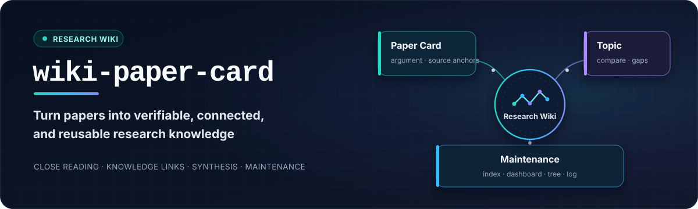
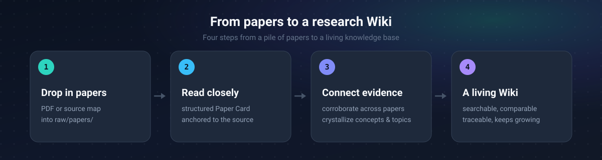

<div align="center">
  <p>
    
  </p>
  <p>
    <a href="LICENSE"></a>
    <a href="CHANGELOG.md"></a>
    <a href="#runtime-and-entry-points"></a>
    <a href="#quick-start"></a>
    <a href="README.md"></a>
  </p>
  <p>
    <a href="#project-positioning">Positioning</a>
    · <a href="#knowledge-loop">Knowledge Loop</a>
    · <a href="#core-capabilities">Capabilities</a>
    · <a href="#quick-start">Quick Start</a>
    · <a href="#usage">Usage</a>
    · <a href="#workflow">Workflow</a>
    · <a href="#project-layout">Project Layout</a>
    · <a href="README.md">中文</a>
  </p>
</div>

---

**`wiki-paper-card` is a paper knowledge framework for long-term research.** It turns each paper into a source-grounded Paper Card, connects reusable concepts and entities across a batch, and uses Topic pages to synthesize methods, results, boundaries, consensus, disagreement, and research gaps around a shared question. As new papers arrive, the Wiki's pages, relationships, indexes, and research dashboard evolve together to support paper review, cross-paper comparison, survey writing, and research planning.

> Status: the core workflow is runnable, while workflow contracts, knowledge rules, and output formats will continue to evolve.

## Project Positioning

`wiki-paper-card` supports researchers who continuously read, compare, and reuse academic papers. It organizes source-grounded close reading, knowledge connection, cross-paper synthesis, and incremental Wiki maintenance into one continuous workflow.

Each paper first becomes a complete Paper Card covering its research question, methods, experiments, conclusion boundaries, limitations, and research ideas, with key claims anchored to a page, figure, table, or equation. Batch processing then connects concepts, entities, and research topics across papers so that evidence about the same knowledge object can accumulate and related methods, results, and disagreements can be compared directly. Researchers can move from any knowledge page back to the source paper for verification, then use existing questions and research gaps to organize the next round of reading.

## Knowledge Loop

Four page types organize paper-level detail, knowledge objects, and research questions. Source evidence and Wiki links connect them, and each page can be updated as new papers enter the collection.

| Page | What it contains | Research value |
|---|---|---|
| **Paper Card** | A paper's research question, core idea, method modules, formulas, experiment-to-claim evidence chain, limitations, critical analysis, and research ideas | Restores the paper's full context quickly and links every key claim back to a page, figure, table, or equation |
| **Concept** | Transferable theories, frameworks, mechanisms, and terms, together with definitions, evidence, relationships, disputes, and open questions from multiple sources | Shows how a concept is interpreted, tested, extended, or challenged across studies and accumulates reusable research understanding |
| **Entity** | Concrete objects such as methods, models, tools, datasets, evaluation resources, organizations, or products, together with their aliases, evidence, relationships, and contradictions | Tracks how the same research object is used, connected, and supported across papers |
| **Topic** | Paper comparisons, key findings, consensus, disagreement, open questions, and research gaps around a shared problem, mechanism, or evidence space | Synthesizes the evidence for a research direction and compares methods, results, and boundaries for survey writing, research planning, and experiment design |

`index.md`, the research dashboard, the knowledge tree, and `log.md` form the maintenance layer for entry points, question and candidate aggregation, navigation, and update history. New papers can create pages or add evidence that supports or challenges existing conclusions, closing the loop from reading and verification through connection and synthesis to later retrieval.

## Core Capabilities

The core goal is to turn papers you have read into research knowledge that remains searchable, verifiable, comparable, and extensible over time.

| The problem you hit | How wiki-paper-card solves it |
|---|---|
| You finish a paper, then forget it and can't find it when writing a survey | Each paper becomes a structured card whose claims, formulas, and figures point back to the source for one-click verification |
| Papers accumulate while concepts, methods, and research objects stay scattered | Concept and Entity pages collect cross-paper evidence, relationships, disputes, and open questions around the same knowledge object |
| Comparing papers and forming a research judgment takes repeated manual work | Topic pages compare methods, results, and boundaries under a shared question while preserving consensus, single-paper claims, disagreements, and source evidence |
| You worry AI output is padded or unreliable | Every claim must land on a page / figure / table / equation anchor, enforced by deterministic audits; sections stay empty when there is nothing of value |
| A growing knowledge base becomes difficult to navigate and maintain | Deterministic scripts write incrementally, repeated runs create no duplicates, and the index, research dashboard, knowledge tree, and log stay maintained automatically |

Cross-paper pages are created or updated when they have independent source support or a direct connection to existing knowledge. Material without cross-paper value remains in its Paper Card.

## Table Of Contents

- [Project Positioning](#project-positioning)
- [Knowledge Loop](#knowledge-loop)
- [Core Capabilities](#core-capabilities)
- [Runtime And Entry Points](#runtime-and-entry-points)
- [Relationship To Upstream nature-skills](#relationship-to-upstream-nature-skills)
- [Design Reference](#design-reference)
- [Quick Start](#quick-start)
- [Usage](#usage)
- [Agent Quick Setup](#agent-quick-setup)
- [Workflow](#workflow)
- [Output Layout](#output-layout)
- [Supported Scope](#supported-scope)
- [Project Layout](#project-layout)
- [Documentation](#documentation)
- [Verification](#verification)
- [Contributing](#contributing)
- [License](#license)

## Runtime And Entry Points

This project supports two runtime hosts:

- 🖥️ [Claude Code](https://code.claude.com/docs/en/overview): used inside [Obsidian](https://obsidian.md/download) with the [Claudian](https://community.obsidian.md/plugins/realclaudian) plugin. The official Claudian repository is on [GitHub](https://github.com/YishenTu/claudian).
- 🤖 [DeepSeek Harness (DSH)](https://github.com/deepseek-ai/deepseek-harness): start a DSH session inside the vault directory — no Obsidian plugin required. See [adapters/dsh/](adapters/dsh/) for the adapter and orchestration mapping.

Open a standalone vault initialized from `template/` in Obsidian, not this repository's root directory. The repository root also contains implementation files such as `vendor/`, `scripts/`, and `tests/`.

## Relationship To Upstream nature-skills

The analysis core and shared rules come from the [nature-skills](https://github.com/Yuan1z0825/nature-skills) project. The upstream directories are pinned in `vendor/nature-paper-card` and `vendor/nature-shared`.

| Responsibility | Source |
|---|---|
| Sections 01-16 card structure, source bundles, evidence grounding, paper-type lenses, upstream audits | `nature-skills` |
| Obsidian path mapping, KB context, batch orchestration, digests, link plans, knowledge gates, Wiki publishing, idempotency | This project |

This project adds an orchestration and knowledge-crystallization layer for Obsidian LLM Wikis on top of the upstream paper-analysis core. See [UPSTREAM.md](UPSTREAM.md) and [THIRD_PARTY_NOTICES.md](THIRD_PARTY_NOTICES.md) for the pinned version, upstream commit, synchronization policy, and third-party notices.

## Design Reference

This project follows Karpathy's [LLM Wiki](https://gist.github.com/karpathy/442a6bf555914893e9891c11519de94f) pattern, using Wiki layering, agent-maintained knowledge, and `index.md`/`log.md` to organize a long-lived knowledge base.

## Quick Start

Once installed, copy these prompts straight to your Agent:

| What you want | What to say |
|---|---|
| Process one paper | `Use wiki-paper-card to process raw/papers/example.pdf.` |
| Batch-process a directory | `Use wiki-paper-card to batch-process raw/papers/knowledge-conflict/.` |
| Regenerate an existing card | `Use wiki-paper-card to reprocess raw/papers/example.pdf.` |

Prerequisites:

- [Claude Code](https://code.claude.com/docs/en/overview) or [DeepSeek Harness](https://github.com/deepseek-ai/deepseek-harness) (one or both)
- [Obsidian](https://obsidian.md/download) (the Claude Code host also needs the [Claudian](https://community.obsidian.md/plugins/realclaudian) plugin)
- Python 3
- PyMuPDF when processing PDF files

Create or select a standalone vault and link it with the install script:

```bash
git clone https://github.com/RamboLQX/wiki-paper-card.git wiki-paper-card
cd wiki-paper-card

VAULT=/path/to/vault
mkdir -p "$VAULT"

# --host can be claude | dsh | both (default: both)
scripts/install.sh --host dsh "$VAULT"
# or connect both hosts at once:
scripts/install.sh --host both "$VAULT"

export WIKI_PAPER_CARD_ROOT="$PWD"
```

The install script is idempotent: it only creates missing directories, templates, and skill links, and never overwrites an existing `CLAUDE.md`, knowledge pages, or `raw/` files in the vault. The Claude Code host links skills into `$VAULT/.claude/skills/` and copies subagents; the DSH host links skills into `$VAULT/.dsh/skills/` (DSH auto-discovers that directory and the vault-root `CLAUDE.md`).

Open `$VAULT` in Obsidian (for the DSH host, start a DSH session in the vault directory), not this repository's root directory. After setting `WIKI_PAPER_CARD_ROOT`, the host can discover `wiki-paper-card`, `wiki-shared`, and the subagents from the vault, and resolve the repository scripts and pinned upstream files through that environment variable. Copying the template alone does not make the skills appear.

Place a paper under `raw/papers/` in the vault and invoke the skill:

```text
Use wiki-paper-card to process raw/papers/example.pdf.
```

See [docs/installation.md](docs/installation.md) for the full installation, environment configuration, and troubleshooting notes.

## Usage

Send `Use wiki-paper-card ...` directly in a Claudian session. If the plugin provides a skill picker, you can also select `wiki-paper-card` first and then give the processing target.

### 1. Place Inputs

- Place paper PDFs and `nature-reader` source-map JSON files under `raw/papers/` in the Obsidian vault.
- `raw/` is read-only. Do not move, overwrite, or delete source files during processing.
- Users must organize `raw/` into their own topic directories; the workflow does not classify papers automatically. For example, use `raw/papers/knowledge-conflict/`.

```text
vault/
├── raw/
│   └── papers/
│       ├── example.pdf
│       └── example.source-map.json
├── wiki/
│   ├── sources/
│   ├── concepts/
│   ├── entities/
│   ├── topics/
│   ├── index.md
│   └── log.md
└── work/
```

For example, `raw/papers/example.pdf` produces the source page `wiki/sources/papers/example.md`.

### 2. Process One Paper

```text
Use wiki-paper-card to process raw/papers/example.pdf.
```

Process a `nature-reader` source map:

```text
Use wiki-paper-card to process raw/papers/example.source-map.json.
```

A single paper produces at least a Paper Card source page under `wiki/sources/`. One paper alone does not create a new concept, entity, or topic.

### 3. Process A Batch

Process all PDFs under a specific directory:

```text
Use wiki-paper-card to batch-process raw/papers/knowledge-conflict/.
```

Process all PDFs under `raw/papers/`:

```text
Use wiki-paper-card to batch-process raw/papers/.
```

Batch processing creates all source pages first and performs cross-paper linking only after every audit passes. We recommend at most 15 papers per batch. The system runs at most three processors concurrently.

### 4. Topics And Cross-Paper Pages

A concept or entity is created only when at least two independent sources support it, or when it is directly needed to connect existing pages or answer an existing open question. A topic is created or updated only when at least two papers share the same problem, mechanism, or evidence space, or when a new paper answers or challenges an existing topic's open questions.

You can state the synthesis goal explicitly:

```text
Use wiki-paper-card to batch-process raw/papers/knowledge-conflict/ and create or update topic pages where at least two papers share the same problem, mechanism, or evidence space.
```

The framework does not force-create pages when the knowledge gates are not satisfied.

### 5. Updates And Reprocessing

Unchanged PDFs are skipped when the same path is processed again. To regenerate one:

```text
Use wiki-paper-card to reprocess raw/papers/example.pdf.
```

Processing updates `wiki/index.md`, `wiki/log.md`, and existing pages without deleting knowledge pages. Batch reports go under `work/`; final knowledge pages go under `wiki/`.

## Agent Quick Setup

An Agent with network access, terminal execution, and local filesystem write permissions can clone the repository, configure the vault, and run the smoke test. For a first-time installation, replace the repository destination, vault path, and runtime host below with actual values:

```text
Configure wiki-paper-card by following these setup instructions:

Setup instructions:
https://raw.githubusercontent.com/RamboLQX/wiki-paper-card/main/docs/agent-quick-setup.md

Project repository:
https://github.com/RamboLQX/wiki-paper-card.git

Repository destination:
/absolute/path/to/wiki-paper-card

Obsidian vault:
/absolute/path/to/vault

Runtime host:
claude / dsh / both

Check the paths and runtime first. If the repository does not exist locally, clone it to the specified destination.
Then run the installer and smoke test, and report completed items separately from steps that still require user action.
Do not overwrite existing files in the vault.
```

If the repository is already cloned, the Agent can read the local instructions directly:

```text
Read /absolute/path/to/wiki-paper-card/docs/agent-quick-setup.md and configure wiki-paper-card.
Project repository: /absolute/path/to/wiki-paper-card
Obsidian vault: /absolute/path/to/vault
Runtime host: claude / dsh / both
```

The Agent creates missing vault directories, links the skills, merges `CLAUDE.md`, sets the environment variable for the current session, and runs the smoke test. Installing Obsidian or Claudian through a graphical interface and persisting the environment variable may still require user confirmation or manual action. See [docs/agent-quick-setup.md](docs/agent-quick-setup.md) for the execution rules and safety boundaries.

## Workflow



New papers produce source-grounded Paper Cards; cross-paper evidence updates Concept, Entity, and Topic pages; indexes and the research dashboard stay synchronized; existing questions and research gaps guide later reading. For the deterministic pipeline behind the scenes (prepare → finalize → audit → publish) and per-script details, see [docs/architecture.md](docs/architecture.md).

## Output Layout

```text
vault/
├── raw/
│   └── papers/
│       └── example.pdf
└── wiki/
    ├── sources/
    │   └── papers/
    │       └── example.md
    ├── concepts/
    ├── entities/
    ├── topics/
    ├── meta/
    ├── index.md
    └── log.md
```

Paper Cards keep the detailed record, concept and entity pages stay thin hubs, and topic pages carry cross-paper synthesis. Audit reports and intermediate files stay in the batch work directory.

## Supported Scope

| Area | Current support |
|---|---|
| Runtime host | Claude Code, DeepSeek Harness (DSH) |
| Obsidian entry point | Claudian (Claude Code host) |
| Primary inputs | PDF and `nature-reader` source maps |
| Wiki writes | Local vault only |
| Output language | Follows the user's language |

## Project Layout

```text
skills/wiki-paper-card/    Workflow entry point, contracts, and subagent briefs
skills/wiki-shared/        Wiki schema, templates, and knowledge rules
adapters/claude-code/      Claude Code subagent wrappers
adapters/dsh/              DeepSeek Harness adapter and orchestration mapping
vendor/nature-paper-card/  Pinned upstream analysis core
vendor/nature-shared/      Pinned upstream shared rules
template/                  Minimal Obsidian vault example
scripts/                   Local deterministic checks, packaging, install, and publishing
docs/                      Installation and architecture documentation
tests/                     Tests for local scripts
```

## Documentation

- [Installation](docs/installation.md)
- [Architecture](docs/architecture.md)
- [Workflow contract](skills/wiki-paper-card/references/workflow-contract.md)
- [Wiki integration](skills/wiki-paper-card/references/wiki-integration.md)
- [Knowledge model](skills/wiki-shared/references/knowledge-model.md)
- [Retrieval protocol](skills/wiki-shared/references/retrieval-protocol.md)
- [DSH adapter](adapters/dsh/dsh-mode.md)
- [Changelog](CHANGELOG.md)

## Verification

```bash
PYTHONDONTWRITEBYTECODE=1 python3 -m unittest discover -s tests -v
PYTHONDONTWRITEBYTECODE=1 python3 scripts/smoke_test.py
PYTHONDONTWRITEBYTECODE=1 python3 -m unittest discover -s vendor/nature-paper-card/tests -v
PYTHONDONTWRITEBYTECODE=1 python3 -m unittest discover -s vendor/nature-shared/tests -v
```

## Contributing

Issues and pull requests are welcome.

- Do not commit personal paper PDFs, private vault content, or real API keys.
- Keep knowledge admission rule changes in `skills/wiki-shared/references/knowledge-model.md`.
- Record the reason and update `UPSTREAM.md` before changing `vendor/`.
- Define acceptance criteria in the relevant workflow contract before adding a new flow.

## License

This project is licensed under the MIT License. See [LICENSE](LICENSE).

`vendor/nature-paper-card` and `vendor/nature-shared` come from the Apache-2.0 licensed `nature-skills` project. See [THIRD_PARTY_NOTICES.md](THIRD_PARTY_NOTICES.md).
