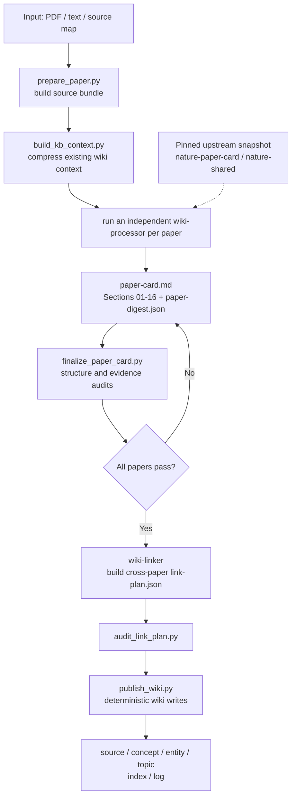

# wiki-paper-card

`wiki-paper-card` is a paper-reading and knowledge-crystallization workflow for Obsidian that turns a growing collection of papers into a traceable, comparable, and extensible personal research Wiki.

It first turns each paper into a Paper Card grounded to pages, figures, tables, and equations, then connects evidence supported by multiple papers into concept, entity, and topic pages during batch processing.

[中文](README.md)


> Status: the core workflow is runnable, while workflow contracts, knowledge rules, and output formats will continue to evolve.

## Runtime And Entry Points

This project runs through [Claude Code](https://code.claude.com/docs/en/overview) inside [Obsidian](https://obsidian.md/download), using the [Claudian](https://community.obsidian.md/plugins/realclaudian) plugin. The official Claudian repository is on [GitHub](https://github.com/YishenTu/claudian).

Open a standalone vault initialized from `template/` in Obsidian, not this repository's root directory. The repository root also contains implementation files such as `vendor/`, `scripts/`, and `tests/`.

## What It Does

`wiki-paper-card` is designed for researchers who maintain a personal research Wiki over time. It separates the workflow into two stages: close reading of each paper, followed by cross-paper selection and connection of knowledge worth promoting.

1. **Read papers**: each paper is processed independently into a complete Sections 01-16 Paper Card, with key claims grounded to pages, figures, tables, and equations so they can be checked against the original.
2. **Crystallize knowledge**: after a batch completes, the project compares candidate concepts and entities across papers. A concept or entity hub page is created only when the same object is supported by at least two independent sources, or when it is directly needed to connect existing Wiki pages or answer an existing open question. Candidates seen in only one paper remain in that paper's Card.

To keep detailed arguments available while making cross-paper comparison and retrieval easier, the project separates paper-level detail from cross-paper knowledge: Paper Cards keep the full record; concept and entity pages keep only stable definitions, source evidence, relations, and contradictions as thin hubs; topic pages carry comparison and synthesis. This keeps the Wiki searchable, comparable, and traceable as it grows.

## Core Capabilities

- Generates Sections 01-16 Paper Cards with page, figure, table, and equation grounding.
- Processes papers in isolated batches so individual analyses do not contaminate each other.
- Uses L0, L1, and L2 knowledge gates to control page creation: paper-local concepts and unverified candidates stay in the Paper Card, and only nodes with sufficient cross-paper evidence become concept or entity hubs.
- Uses topic pages to compare methods, evidence, models, datasets, and results across papers; distinguishes consensus / single-paper claims / conflicts, keeps both sides of a contradiction with resolving evidence, and records research gaps with a source anchor, testable direction, and continuity.
- Grows incrementally: a new paper can promote an existing L1 candidate to an L2 hub, merge into an existing topic comparison table, and answer an existing open question; pending candidates, open questions, and research gaps accumulate by domain in the `wiki/meta/research.md` dashboard.
- Writes only content that changes a reader's judgment; leaves a section empty when there is no genuine finding (no padding).
- Uses deterministic prepare, finalize, audit, and publish scripts; repeated updates do not create duplicate content and include structured verification.
- Maintains `wiki/index.md`, `wiki/log.md`, and source-page links without returning full paper text to the main session, keeping context use bounded.

| Tier | Meaning | Handling |
|---|---|---|
| L0 | A local name, component, or intermediate concept meaningful only in the current paper | Kept in the Paper Card; no standalone page |
| L1 | Independently definable, but not yet supported by a second independent source | Kept in the Paper Card as a candidate |
| L2 | Supported by at least two independent sources, or directly needed to connect existing Wiki pages or answer an existing open question | Creates or updates a concept/entity hub page |

## Relationship To Upstream `nature-skills`

The analysis core and shared rules come from the [nature-skills](https://github.com/Yuan1z0825/nature-skills) project. The upstream directories are pinned in `vendor/nature-paper-card` and `vendor/nature-shared`.

| Responsibility | Source |
|---|---|
| Sections 01-16 card structure, source bundles, evidence grounding, paper-type lenses, upstream audits | `nature-skills` |
| Obsidian path mapping, KB context, batch orchestration, digests, link plans, knowledge gates, Wiki publishing, idempotency | This project |

This project adds an orchestration and knowledge-crystallization layer for Obsidian LLM Wikis on top of the upstream paper-analysis core. See [UPSTREAM.md](UPSTREAM.md) and [THIRD_PARTY_NOTICES.md](THIRD_PARTY_NOTICES.md) for the pinned version, upstream commit, synchronization policy, and third-party notices.

## Design Reference

This project follows Karpathy's [LLM Wiki](https://gist.github.com/karpathy/442a6bf555914893e9891c11519de94f) pattern, using Wiki layering, agent-maintained knowledge, and `index.md`/`log.md` to organize a long-lived knowledge base.

## Quick Start

Prerequisites:

- [Claude Code](https://code.claude.com/docs/en/overview)
- [Obsidian](https://obsidian.md/download) with the [Claudian](https://community.obsidian.md/plugins/realclaudian) plugin
- Python 3
- PyMuPDF when processing PDF files

Create or select a standalone vault, copy the contents of `template/` into it, then link this repository's skills and agents into that vault:

```bash
git clone <repository-url> wiki-paper-card
cd wiki-paper-card

VAULT=/path/to/vault
mkdir -p "$VAULT"
cp -R -n template/* "$VAULT/"

mkdir -p "$VAULT/.claude/skills" "$VAULT/.claude/agents"
ln -s "$PWD/skills/wiki-paper-card" "$VAULT/.claude/skills/wiki-paper-card"
ln -s "$PWD/skills/wiki-shared" "$VAULT/.claude/skills/wiki-shared"
cp adapters/claude-code/agents/*.md "$VAULT/.claude/agents/"
cp template/CLAUDE.md "$VAULT/CLAUDE.md"

export WIKI_PAPER_CARD_ROOT="$PWD"
```

Open `$VAULT` in Obsidian, not this repository's root directory. The `-n` flag preserves files that already exist in the target vault. If it already has a `CLAUDE.md`, merge the relevant sections instead of overwriting it.

`template/` only provides the vault layout. After creating these links and setting `WIKI_PAPER_CARD_ROOT`, Claudian can discover `wiki-paper-card`, `wiki-shared`, and the subagents from the vault, and resolve the repository scripts and pinned upstream files through that environment variable. Copying the template alone does not make the skills appear.

Place a paper under `raw/papers/` in the vault and invoke the skill from a Claudian session:

```text
Use wiki-paper-card to process raw/papers/example.pdf.
```

See [docs/installation.md](docs/installation.md) for the full installation, environment configuration, and troubleshooting notes.

## Usage

Send `Use wiki-paper-card ...` directly in a Claudian session. If the plugin provides a skill picker, you can also select `wiki-paper-card` first and then give the processing target.

### 1. Place Inputs

- Place paper PDFs and `nature-reader` source-map JSON files under `raw/papers/` in the Obsidian vault.
- `raw/` is read-only. Do not move, overwrite, or delete source files during processing.
- Users must organize `raw/` into their own topic directories; the workflow does not classify papers automatically. For example, use `raw/papers/knowledge-conflict/`.

```text
vault/
├── raw/
│   └── papers/
│       ├── example.pdf
│       └── example.source-map.json
├── wiki/
│   ├── sources/
│   ├── concepts/
│   ├── entities/
│   ├── topics/
│   ├── index.md
│   └── log.md
└── work/
```

For example, `raw/papers/example.pdf` produces the source page `wiki/sources/papers/example.md`.

### 2. Process One Paper

```text
Use wiki-paper-card to process raw/papers/example.pdf.
```

Process a `nature-reader` source map:

```text
Use wiki-paper-card to process raw/papers/example.source-map.json.
```

A single paper produces at least a Paper Card source page under `wiki/sources/`. One paper alone does not create a new concept, entity, or topic.

### 3. Process A Batch

Process all PDFs under a specific directory:

```text
Use wiki-paper-card to batch-process raw/papers/knowledge-conflict/.
```

Process all PDFs under `raw/papers/`:

```text
Use wiki-paper-card to batch-process raw/papers/.
```

Batch processing creates all source pages first and performs cross-paper linking only after every audit passes. We recommend at most 15 papers per batch. The system runs at most three processors concurrently.

### 4. Topics And Cross-Paper Pages

A concept or entity is created only when at least two independent sources support it, or when it is directly needed to connect existing pages or answer an existing open question. A topic is created or updated only when at least two papers share the same problem, mechanism, or evidence space, or when a new paper answers or challenges an existing topic's open questions.

You can state the synthesis goal explicitly:

```text
Use wiki-paper-card to batch-process raw/papers/knowledge-conflict/ and create or update topic pages where at least two papers share the same problem, mechanism, or evidence space.
```

The framework does not force-create pages when the knowledge gates are not satisfied.

### 5. Updates And Reprocessing

Unchanged PDFs are skipped when the same path is processed again. To regenerate one:

```text
Use wiki-paper-card to reprocess raw/papers/example.pdf.
```

Processing updates `wiki/index.md`, `wiki/log.md`, and existing pages without deleting knowledge pages. Batch reports go under `work/`; final knowledge pages go under `wiki/`.

## Agent Quick Setup

Users can start the setup from their own Agent tool with one prompt instead of running every command manually:

```text
Read /path/to/wiki-paper-card/docs/agent-quick-setup.md and configure wiki-paper-card.
Project repository: /path/to/wiki-paper-card
Obsidian vault: /path/to/vault
```

The Agent creates missing vault directories, links the skills, merges `CLAUDE.md`, sets the environment variable, and runs the smoke test. See [docs/agent-quick-setup.md](docs/agent-quick-setup.md) for the execution rules and safety boundaries.

## Workflow



## Output Layout

```text
vault/
├── raw/
│   └── papers/
│       └── example.pdf
└── wiki/
    ├── sources/
    │   └── papers/
    │       └── example.md
    ├── concepts/
    ├── entities/
    ├── topics/
    ├── meta/
    ├── index.md
    └── log.md
```

Paper Cards keep the detailed record, concept and entity pages stay thin hubs, and topic pages carry cross-paper synthesis. Audit reports and intermediate files stay in the batch work directory.

## Supported Scope

| Area | Current support |
|---|---|
| Runtime host | Claude Code |
| Obsidian entry point | Claudian |
| Primary inputs | PDF and `nature-reader` source maps |
| Wiki writes | Local vault only |
| Output language | Follows the user's language |

Other LLM runtime adapters are not yet part of the supported scope.

## Project Layout

```text
skills/wiki-paper-card/    Workflow entry point, contracts, and subagent briefs
skills/wiki-shared/        Wiki schema, templates, and knowledge rules
adapters/claude-code/      Claude Code subagent wrappers
vendor/nature-paper-card/  Pinned upstream analysis core
vendor/nature-shared/      Pinned upstream shared rules
template/                  Minimal Obsidian vault example
scripts/                   Local deterministic checks, packaging, and publishing
docs/                      Installation and architecture documentation
tests/                     Tests for local scripts
```

## Documentation

- [Installation](docs/installation.md)
- [Architecture](docs/architecture.md)
- [Workflow contract](skills/wiki-paper-card/references/workflow-contract.md)
- [Wiki integration](skills/wiki-paper-card/references/wiki-integration.md)
- [Knowledge model](skills/wiki-shared/references/knowledge-model.md)

## Verification

```bash
PYTHONDONTWRITEBYTECODE=1 python3 -m unittest discover -s tests -v
PYTHONDONTWRITEBYTECODE=1 python3 scripts/smoke_test.py
PYTHONDONTWRITEBYTECODE=1 python3 -m unittest discover -s vendor/nature-paper-card/tests -v
PYTHONDONTWRITEBYTECODE=1 python3 -m unittest discover -s vendor/nature-shared/tests -v
```

## Contributing

Issues and pull requests are welcome.

- Do not commit personal paper PDFs, private vault content, or real API keys.
- Keep knowledge admission rule changes in `skills/wiki-shared/references/knowledge-model.md`.
- Record the reason and update `UPSTREAM.md` before changing `vendor/`.
- Define acceptance criteria in the relevant workflow contract before adding a new flow.

## License

This project is licensed under the MIT License. See [LICENSE](LICENSE).

`vendor/nature-paper-card` and `vendor/nature-shared` come from the Apache-2.0 licensed `nature-skills` project. See [THIRD_PARTY_NOTICES.md](THIRD_PARTY_NOTICES.md).
