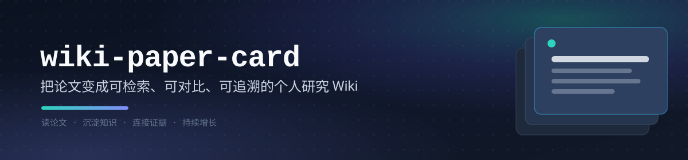

<div align="center">
  <p>
    
  </p>
  <p>
    <a href="LICENSE"></a>
    <a href="CHANGELOG.md"></a>
    <a href="#运行环境与入口"></a>
    <a href="#快速开始"></a>
    <a href="README.en.md"></a>
  </p>
  <p>
    <a href="#项目定位">项目定位</a>
    · <a href="#知识闭环">知识闭环</a>
    · <a href="#核心能力">核心能力</a>
    · <a href="#能力入口">能力入口</a>
    · <a href="#快速开始">快速开始</a>
    · <a href="#使用方式">使用方式</a>
    · <a href="#工作流程">工作流程</a>
    · <a href="#项目结构">项目结构</a>
    · <a href="README.en.md">English</a>
  </p>
</div>

---

**`wiki-paper-card` 是一套面向长期研究的论文知识组织框架。** 它将每篇论文整理为带原文定位的 Paper Card，并通过 Topic 页面综合同一研究问题下的方法、结果、边界、共识、分歧与研究空白。随着论文持续加入，Wiki 中的知识页面、关系、索引和研究仪表盘同步更新，为论文回顾、跨论文比较、综述写作和研究选题提供可核验的知识基础。

> 状态：核心流程已稳定可运行，测试通过；流程契约与知识规则仍会持续细化。

## 项目定位

`wiki-paper-card` 面向需要持续阅读、比较和复用学术论文的研究人员。项目以原文证据为基础，将单篇精读、知识连接、跨论文综合和 Wiki 增量维护组织为一套连续流程。

每篇论文首先形成一张完整的 Paper Card，保留研究问题、方法、实验、结论边界、局限和研究想法，并为关键结论记录页码、图、表或公式位置。批量处理随后连接多篇论文：相关论文的方法、结果与分歧在 Topic 页面累积和比较。用户可以从任意知识页面回到来源论文核验，也可以从已有问题和研究空白继续组织下一批阅读。

## 知识闭环

三类页面共同组织论文细节、知识对象和研究问题。它们通过来源证据和 Wiki 链接相互连接，并随着新论文加入持续更新。

| 页面 | 承载的内容 | 为研究带来的价值 |
|---|---|---|
| **Paper Card** | 单篇论文的研究问题、核心思想、方法模块、公式、实验与结论证据链，以及局限、批判性分析和研究想法 | 快速恢复论文的完整上下文；从关键结论直接返回页码、图、表或公式核验 |
| **Topic** | 围绕共享问题、机制或证据空间组织的论文对照、关键发现、共识、分歧、开放问题和研究空白 | 综合一个研究方向的现有证据，比较方法、结果与适用边界，为综述、选题和实验设计提供依据 |

`index.md`、研究仪表盘、知识树和 `log.md` 构成持续维护层，分别负责统一入口、开放问题与研究空白汇总、知识导航和更新记录。新的论文既可以创建页面，也可以补充或挑战已有结论，使阅读、核验、连接、综合和再次检索形成闭环。

## 核心能力

核心目标是把已经阅读的论文转化为能够长期检索、核验、比较和继续积累的研究知识。

| 你遇到的问题 | wiki-paper-card 的解法 |
|---|---|
| 论文读完就忘，写综述、开新题时想不起也找不到 | 每篇论文精读成一张结构化卡片，结论、公式、图表都带原文定位，随时跳回 PDF 核对 |
| 论文越攒越多，方法和研究对象散落各处 | Topic 页面在同一问题下对照论文，让同一研究问题下的知识保持连续 |
| 难以比较多篇论文并形成研究判断 | Topic 页面在共享问题下对照方法、结果和边界，同时保留共识、单篇主张、分歧与来源证据 |
| 担心 AI 生成的内容注水、不可信 | 每条结论必须落到页码 / 图 / 表 / 公式证据，审计脚本强制校验，没有价值的就留空 |
| 知识库长期增长后难以导航和维护 | 确定性脚本增量写入，重复处理不产生重复内容，索引、研究仪表盘、知识树和日志自动维护 |

topic 页基于独立来源支持或已有知识连接创建和更新；尚未形成跨论文价值的内容保留在 Paper Card 中。

## 能力入口

框架提供三个相互衔接的入口，覆盖「论文入库 → 知识检索 → 空白挖掘」的完整闭环：

| 你想做什么 | 使用入口 | 产物 |
|---|---|---|
| 精读或批量处理论文 | `wiki-paper-card` | Paper Card、topic 页、index/log |
| 在知识库上提问、检索、查证或写综述 | 检索协议（`wiki-shared`） | 基于知识树的 lookup / survey 检索，只读不回写 |
| 跨组或全库挖掘研究空白与候选方向 | `wiki-gap-mining` | 空白挖掘报告，确认后写回 topic 页 |

- `wiki-paper-card` 负责论文处理：把每篇论文精读为带原文定位的 Paper Card，并在跨论文证据满足条件时创建或更新 topic 页。
- 检索遵循 [skills/wiki-shared/references/retrieval-protocol.md](skills/wiki-shared/references/retrieval-protocol.md)：面向已有知识库的问答与综述，先读 `wiki/meta/knowledge-tree.md`，按 lookup（预算剪枝）或 survey（领域整树展开）模式检索；只读，不回写 wiki。
- `wiki-gap-mining` 负责空白挖掘：在指定领域范围或全库深挖研究空白与候选方向，产出 `work/gap-mining-report.md`，经用户确认后走确定性审计写回 topic 页。

三者共享同一套知识模型与确定性发布管线：处理负责写入，检索负责读取，空白挖掘负责发现下一步该读什么。

## 目录

- [项目定位](#项目定位)
- [知识闭环](#知识闭环)
- [核心能力](#核心能力)
- [能力入口](#能力入口)
- [运行环境与入口](#运行环境与入口)
- [与上游 nature-skills 的关系](#与上游-nature-skills-的关系)
- [设计参考](#设计参考)
- [快速开始](#快速开始)
- [使用方式](#使用方式)
- [Agent 快速安装](#agent-快速安装)
- [工作流程](#工作流程)
- [输出结构](#输出结构)
- [支持范围](#支持范围)
- [项目结构](#项目结构)
- [文档](#文档)
- [验证](#验证)
- [贡献](#贡献)
- [许可证](#许可证)

## 运行环境与入口

本项目支持两个运行宿主：

- 🖥️ [Claude Code](https://code.claude.com/docs/en/overview)：在 [Obsidian](https://obsidian.md/download) 中通过 [Claudian](https://community.obsidian.md/plugins/realclaudian) 插件使用。Claudian 的官方仓库见 [GitHub](https://github.com/YishenTu/claudian)。
- 🤖 [DeepSeek Harness（DSH）](https://github.com/deepseek-ai/deepseek-harness)：在 Vault 目录中启动 DSH 会话即可，无需 Obsidian 插件。适配与编排映射见 [adapters/dsh/](adapters/dsh/)。

推荐在 Obsidian 中打开一个由 `template/` 初始化的独立 Vault，不要直接打开本仓库根目录。仓库根目录还包含 `vendor/`、`scripts/`、`tests/` 等实现文件。

## 与上游 nature-skills 的关系

本项目的分析内核和共享规则来自 [nature-skills](https://github.com/Yuan1z0825/nature-skills) 项目。上游目录以固定快照形式保存在 `vendor/nature-paper-card` 和 `vendor/nature-shared` 下。

| 职责 | 来源 |
|---|---|
| Sections 01-16 卡片结构、来源包、证据定位、论文类型镜头、上游审计 | `nature-skills` |
| Obsidian 路径映射、KB context、批量编排、digest、link plan 与 topic 决策、Wiki 发布与幂等更新 | 本项目 |

本项目在上游论文分析内核之上，增加面向 Obsidian LLM Wiki 的编排和知识结晶层。固定版本、上游 commit、同步策略和第三方声明见 [UPSTREAM.md](UPSTREAM.md) 与 [THIRD_PARTY_NOTICES.md](THIRD_PARTY_NOTICES.md)。

## 设计参考

本项目参考 Karpathy 的 [LLM Wiki](https://gist.github.com/karpathy/442a6bf555914893e9891c11519de94f) 思路，采用 Wiki 分层、Agent 持续维护以及 `index.md`、`log.md` 来组织长期维护的知识库。

## 快速开始

安装完成后，直接复制这些话给 Agent：

| 想做什么 | 直接这样说 |
|---|---|
| 处理一篇论文 | `Use wiki-paper-card to process raw/papers/example.pdf.` |
| 批量处理一个目录 | `Use wiki-paper-card to batch-process raw/papers/knowledge-conflict/.` |
| 重新生成已有卡片 | `Use wiki-paper-card to reprocess raw/papers/example.pdf.` |

前置条件：

- [Claude Code](https://code.claude.com/docs/en/overview) 或 [DeepSeek Harness](https://github.com/deepseek-ai/deepseek-harness)（二选一或都要）
- [Obsidian](https://obsidian.md/download)（Claude Code 宿主需安装 [Claudian](https://community.obsidian.md/plugins/realclaudian) 插件）
- Python 3
- 处理 PDF 时安装 PyMuPDF

新建或选择一个独立 Vault，用安装脚本接入：

```bash
git clone https://github.com/RamboLQX/wiki-paper-card.git wiki-paper-card
cd wiki-paper-card

VAULT=/path/to/vault
mkdir -p "$VAULT"

# --host 可选 claude | dsh | both（默认 both）
scripts/install.sh --host dsh "$VAULT"
# 或同时接入两个宿主：
scripts/install.sh --host both "$VAULT"

export WIKI_PAPER_CARD_ROOT="$PWD"
```

安装脚本幂等：只创建缺失的目录、模板文件和 skill 链接，不会覆盖 Vault 中已有的 `CLAUDE.md`、知识页面或 `raw/` 资料。Claude Code 宿主会把 skill 链接到 `$VAULT/.claude/skills/` 并复制子 Agent；DSH 宿主会把 skill 链接到 `$VAULT/.dsh/skills/`（DSH 自动发现该目录与 Vault 根目录的 `CLAUDE.md`）。

在 Obsidian 中打开 `$VAULT`（DSH 宿主则在 Vault 目录中启动 DSH 会话），不要打开本仓库根目录。设置 `WIKI_PAPER_CARD_ROOT` 后，宿主才能从 Vault 中发现 `wiki-paper-card`、`wiki-shared` 和子 Agent，并通过该环境变量找到仓库中的脚本与上游快照；只复制模板但不执行安装，skill 不会自动出现。

把论文放到 Vault 的 `raw/papers/` 下，然后发送：

```text
Use wiki-paper-card to process raw/papers/example.pdf.
```

完整安装说明、环境配置和异常排查见 [docs/installation.md](docs/installation.md)。

## 使用方式

在 Claudian 会话中直接发送 `Use wiki-paper-card ...`。如果插件提供了 skill 选择菜单，也可以先选中 `wiki-paper-card`，再给出处理目标。

### 1. 放置输入

- 论文 PDF 和 `nature-reader` source-map JSON 都放在 Obsidian Vault 的 `raw/papers/` 下。
- `raw/` 只读，处理期间不要移动、覆盖或删除原文件。
- `raw/` 下的主题分类目录需要用户自行规划，系统不会自动分类；建议按研究主题创建子目录，例如 `raw/papers/knowledge-conflict/`。

```text
vault/
├── raw/
│   └── papers/
│       ├── example.pdf
│       └── example.source-map.json
├── wiki/
│   ├── sources/
│   ├── topics/
│   ├── index.md
│   └── log.md
└── work/
```

例如，`raw/papers/example.pdf` 会生成 `wiki/sources/papers/example.md` 来源页。

### 2. 单篇处理

```text
Use wiki-paper-card to process raw/papers/example.pdf.
```

处理 `nature-reader` source map：

```text
Use wiki-paper-card to process raw/papers/example.source-map.json.
```

单篇处理至少会生成 `wiki/sources/` 下的 Paper Card 来源页。单篇论文不会凭空创建新的 topic。

### 3. 批量处理

处理指定目录下的全部 PDF：

```text
Use wiki-paper-card to batch-process raw/papers/knowledge-conflict/.
```

处理 `raw/papers/` 下的全部 PDF：

```text
Use wiki-paper-card to batch-process raw/papers/.
```

批量处理会先生成所有来源页，全部审计通过后再做跨论文链接。建议每批不超过 15 篇，系统最多同时运行 3 个 processor。

### 4. topic 与跨论文页面

topic 只有在至少两篇论文共享同一问题、机制或证据空间，或者新论文回答或挑战已有 topic 的开放问题时才会创建或更新。新论文回答了既有开放问题或填补了研究空白时，该条目标记为已解决并归档到 topic 页的「已解决的问题/已解决的研究空白」小节，研究仪表盘与知识树只显示仍开放的条目。公开数据集、基准、模型族与指标保留在各篇 Paper Card 的 Section 14/15 中，不建独立页面。

批量处理时可以明确提出综合目标：

```text
Use wiki-paper-card to batch-process raw/papers/knowledge-conflict/ and create or update topic pages where at least two papers share the same problem, mechanism, or evidence space.
```

如果条件不满足，框架不会因为提示词要求而强行建页。

已有 vault 中的旧 concept 页面和旧 entity 页面不再被发布器写入或更新，也不会出现在知识树中；可手动标记 `archived` 或保留为只读参考。

### 5. 跨组与全库空白挖掘

当知识库已积累多组论文后，可以让框架在指定范围内深挖研究空白与候选方向，并综合已解决的问题：

```text
Use wiki-gap-mining to mine research gaps and candidate directions across
the knowledge-conflict and safety groups.

Use wiki-gap-mining to mine research gaps across the whole wiki.
```

挖掘先只读：生成 `work/gap-mining-report.md`，给出候选空白（每条带来源锚点、可检验方向与建议落点）、跨组已解决关系与已解决轨迹。用户确认采纳后，框架生成 `purpose: "mining"` 的 link-plan，走确定性审计与 `publish_wiki.py` 写回 topic 页——跨组新方向可新建 topic（需至少两篇已有论文支撑），写回后研究仪表盘与知识树同步刷新。

### 6. 更新与重新处理

同一 PDF 未变化时，重复处理会跳过。需要重新生成时使用：

```text
Use wiki-paper-card to reprocess raw/papers/example.pdf.
```

处理结果会更新 `wiki/index.md`、`wiki/log.md` 和已有页面，不会自动删除已有知识页。批次中间报告写入 `work/`，最终知识页面写入 `wiki/`。

## Agent 快速安装

具备网络访问、终端执行和本地文件写入权限的 Agent 可以完成仓库克隆、Vault 配置和 smoke test。首次安装时，先把下面的仓库安装目录、Vault 路径和运行宿主替换为实际值：

```text
请按照以下安装说明配置 wiki-paper-card：

安装说明：
https://raw.githubusercontent.com/RamboLQX/wiki-paper-card/main/docs/agent-quick-setup.md

项目仓库：
https://github.com/RamboLQX/wiki-paper-card.git

仓库安装目录：
/absolute/path/to/wiki-paper-card

Obsidian Vault：
/absolute/path/to/vault

运行宿主：
claude / dsh / both

请先检查路径和运行环境。如果仓库尚未存在，将仓库克隆到指定目录；
然后执行安装脚本、运行 smoke test，并分别报告已完成项目和仍需手动完成的步骤。
不要覆盖 Vault 中已有文件。
```

仓库已经克隆时，可以直接让 Agent 读取本地说明：

```text
请阅读 /absolute/path/to/wiki-paper-card/docs/agent-quick-setup.md，并帮我配置 wiki-paper-card。
项目仓库：/absolute/path/to/wiki-paper-card
Obsidian Vault：/absolute/path/to/vault
运行宿主：claude / dsh / both
```

Agent 会补齐 Vault 目录、链接 skill、合并 `CLAUDE.md`、设置当前会话环境变量并运行 smoke test。Obsidian、Claudian 等图形界面安装和环境变量持久化可能需要用户确认或手动完成。详细执行规则和安全边界见 [docs/agent-quick-setup.md](docs/agent-quick-setup.md)。

## 工作流程


新论文生成带原文定位的 Paper Card，跨论文证据更新 Topic，索引和研究仪表盘同步维护；已有开放问题与研究空白又能组织后续阅读。背后的确定性流水线（prepare → finalize → audit → publish）与逐脚本细节见 [docs/architecture.md](docs/architecture.md)。

## 输出结构

```text
vault/
├── raw/
│   └── papers/
│       └── example.pdf
└── wiki/
    ├── sources/
    │   └── papers/
    │       └── example.md
    ├── topics/
    ├── meta/
    ├── index.md
    └── log.md
```

Paper Card 保留论文的完整细节；topic 页面负责跨论文综合。审计报告和中间文件位于对应批次的工作目录，不进入最终 Wiki。

## 支持范围

| 项目 | 当前支持 |
|---|---|
| 运行宿主 | Claude Code、DeepSeek Harness（DSH） |
| Obsidian 入口 | Claudian（Claude Code 宿主） |
| 主要输入 | PDF、`nature-reader` source map |
| Wiki 写入 | 本地 Vault |
| 输出语言 | 跟随用户语言 |

## 项目结构

```text
skills/wiki-paper-card/    工作流入口、契约和子 Agent 说明
skills/wiki-shared/        Wiki schema、模板和知识结晶规则
adapters/claude-code/      Claude Code subagent wrapper
adapters/dsh/              DeepSeek Harness 适配与编排映射
vendor/nature-paper-card/  固定的上游分析内核
vendor/nature-shared/      固定的上游共享规则
template/                  最小 Obsidian Vault 示例
scripts/                   本地确定性检查、打包、安装和发布脚本
docs/                      安装和架构文档
tests/                     项目脚本测试
```

## 文档

- [安装与运行](docs/installation.md)
- [架构说明](docs/architecture.md)
- [工作流契约](skills/wiki-paper-card/references/workflow-contract.md)
- [Wiki 集成规则](skills/wiki-paper-card/references/wiki-integration.md)
- [知识结晶模型](skills/wiki-shared/references/knowledge-model.md)
- [检索协议](skills/wiki-shared/references/retrieval-protocol.md)
- [DSH 适配](adapters/dsh/dsh-mode.md)
- [变更记录](CHANGELOG.md)

## 验证

```bash
PYTHONDONTWRITEBYTECODE=1 python3 -m unittest discover -s tests -v
PYTHONDONTWRITEBYTECODE=1 python3 scripts/smoke_test.py
PYTHONDONTWRITEBYTECODE=1 python3 -m unittest discover -s vendor/nature-paper-card/tests -v
PYTHONDONTWRITEBYTECODE=1 python3 -m unittest discover -s vendor/nature-shared/tests -v
```

## 贡献

欢迎通过 Issue 和 Pull Request 参与。

- 请勿提交个人论文 PDF、私人 Vault 内容或真实 API Key。
- 修改知识准入规则时，请集中在 `skills/wiki-shared/references/knowledge-model.md`。
- 修改 `vendor/` 前，请记录原因并更新 `UPSTREAM.md`。
- 新增流程前，请先在对应 workflow contract 中明确验收条件。

## 许可证

本项目使用 MIT License，详见 [LICENSE](LICENSE)。

`vendor/nature-paper-card` 和 `vendor/nature-shared` 来自 Apache-2.0 许可的 `nature-skills` 项目，相关声明见 [THIRD_PARTY_NOTICES.md](THIRD_PARTY_NOTICES.md)。
