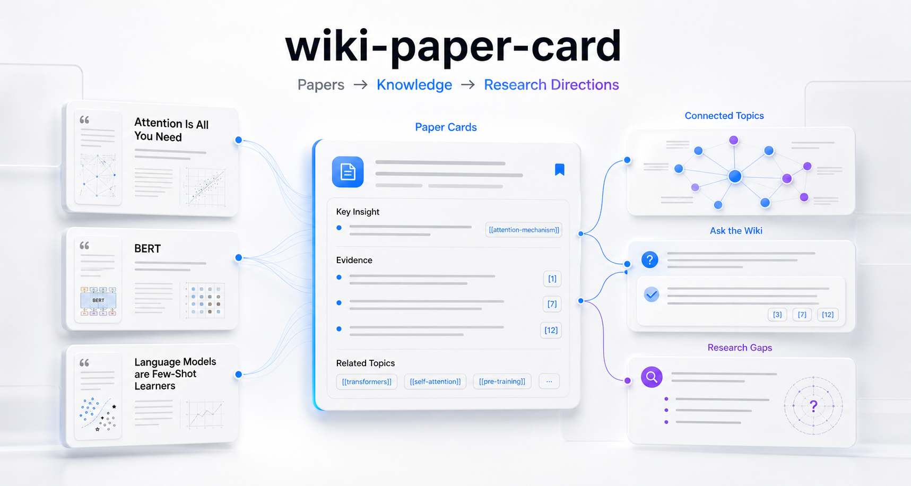
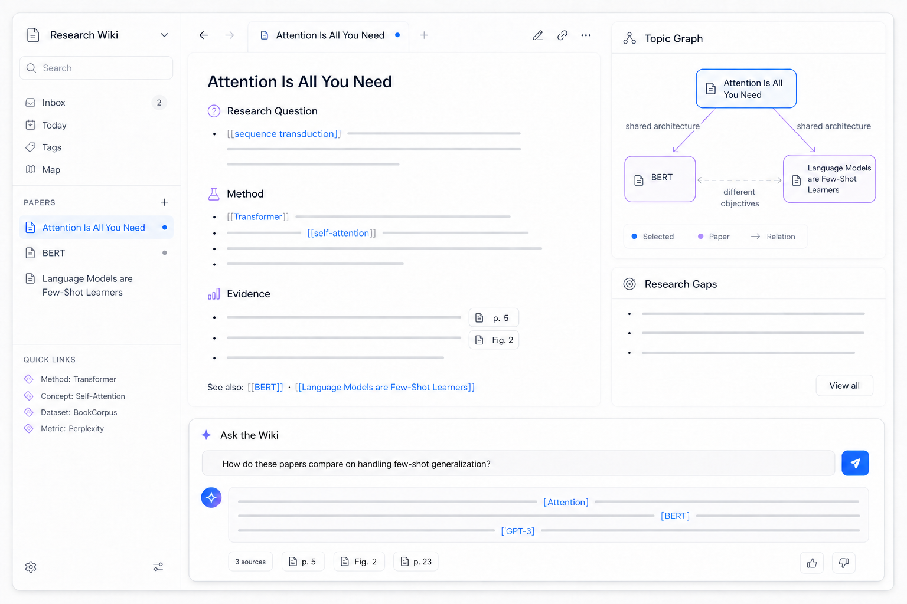
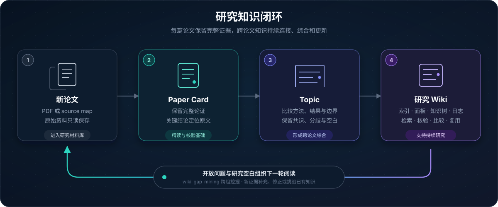
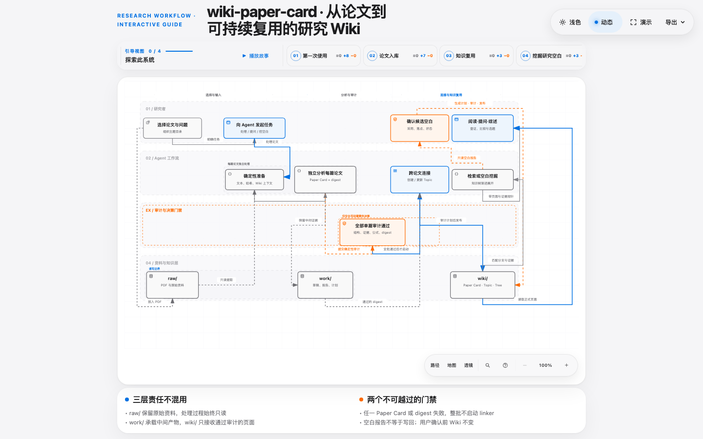

<div align="center">
  <h1>wiki-paper-card</h1>
  <p><strong>把论文阅读转化为可以持续积累、提问和发现研究方向的个人研究 Wiki。</strong></p>
  <p>
    
  </p>
  <p>
    <a href="LICENSE"></a>
    <a href="CHANGELOG.md"></a>
    <a href="#31-运行前提"></a>
    <a href="#3-安装"></a>
    <a href="README.en.md"></a>
  </p>
</div>

---

在 Agents 时代，科研积累正在从资料保存转向知识与经验的数字化累积。

`wiki-paper-card` 将论文中的研究问题、方法、证据、结论和局限整理为可核验的知识页面，再建立论文之间的联系。研究者可以直接向知识库提问，也可以从已有知识中继续挖掘开放问题和研究空白。

## 目录

- [1. 项目价值](#1-项目价值)
  - [1.1 研究工作中的常见问题](#11-研究工作中的常见问题)
  - [1.2 wiki-paper-card 能够形成什么结果](#12-wiki-paper-card-能够形成什么结果)
  - [1.3 从论文到研究 Wiki](#13-从论文到研究-wiki)
  - [1.4 Skill 索引](#14-skill-索引)
- [2. 快速开始](#2-快速开始)
- [3. 安装](#3-安装)
- [4. 框架结构与运行约定](#4-框架结构与运行约定)
  - [4.3 工作产物与工作流](#43-工作产物与工作流)
- [5. 技术设计](#5-技术设计)
- [6. 贡献](#6-贡献)
- [7. 许可证](#7-许可证)

## 1. 项目价值

### 1.1 研究工作中的常见问题

**阅读成果难以长期复用**

研究者读完一篇论文后，通常只记得主要结论。论文解决了什么问题、方法依赖哪些条件、实验如何支持结论、结论有哪些适用边界，会随着时间逐渐模糊。写综述、设计实验或核对引用时，研究者仍然需要重新阅读原文。已经投入的阅读时间没有形成可直接调用的知识。

**多篇论文难以形成系统认识**

同一研究问题往往由多篇论文共同推进。有些论文从不同数据集或实验条件得到相近结果，有些论文得出不同结论，还有一些论文对已有方法进行扩展、修正或限定。研究者需要知道哪些结论得到多篇论文支持，哪些结果存在分歧，分歧来自什么实验条件，以及每种方法适用于什么范围。文件夹和单篇笔记无法持续维护这些关系。

**研究问题与研究空白缺少持续维护**

开放问题是已有论文提出但尚未充分回答的问题。研究空白是现有方法、数据、评价方式或适用范围中仍然缺少证据的部分。新论文可能回答已有问题，也可能暴露新的限制。缺少持续维护时，研究者在写综述或考虑选题前，仍然需要重新检查整个方向的论文和结论。

为了解决阅读成果难以复用、跨论文关系难以整理、研究问题难以持续跟踪等问题，`wiki-paper-card` 将论文分析、知识连接、知识库问答和研究空白挖掘组织为一套持续更新的研究 Wiki。

### 1.2 wiki-paper-card 能够形成什么结果

<p align="center">
  
</p>

| 核心能力 | 你会得到 | 为研究带来的价值 |
|---|---|---|
| **单篇论文深度分析** | 结构完整的 Paper Card，包含研究问题、方法条件、实验依据、关键结论、局限与原文位置 | 重新进入论文上下文时，可以快速恢复理解并回到原文核验 |
| **跨论文知识连接** | 围绕共享研究问题组织的 Topic，包含方法比较、证据关系、结果分歧和适用边界 | 写综述或比较方法时，可以直接查看一个方向的整体认识 |
| **基于知识库提问** | 基于人与 Agent 共用的知识树定位相关 Paper Card 和 Topic，生成带来源依据的回答、比较或综述 | 直接调用已经积累的研究知识，减少重复翻阅和整理 |
| **研究空白挖掘** | 汇总开放问题、证据不足之处和候选研究方向的 Gap Report | 盘点仍待回答的问题，为后续阅读、实验设计和选题提供线索 |

Paper Card 保留单篇论文的完整上下文。Topic 维护多篇论文围绕同一问题形成的认识。知识树连接已有页面，为检索、问答和空白挖掘提供入口。关键结论保留页码、图、表或公式位置，方便研究者检查来源。

### 1.3 从论文到研究 Wiki



论文首先进入独立分析流程，生成经过检查的 Paper Card。相关论文满足准入条件后，框架创建或更新 Topic，并同步维护索引、知识树和日志。研究者可以基于现有 Wiki 进行提问、查证和综述检索，也可以进一步挖掘跨主题的研究空白。

原始论文始终保留在 `raw/`。中间报告写入 `work/`。通过审计的知识页面发布到 `wiki/`。这套分层结构将原始材料、处理过程和最终知识分开管理。

### 1.4 Skill 索引

当前 `skills/` 下包含以下可触发技能；`skills/wiki-shared/` 是共享内容目录，不计入技能索引。点击技能名或“详情页”可以进入每个 Skill 的单独说明页面。

| 技能 | 状态 | 用途 | 触发词 | 详情页 |
|---|---|---|---|---|
| [`wiki-paper-card`](skills/wiki-paper-card/README.md) | **Stable** | 分析单篇论文或批量处理主题目录，生成 Paper Card，并更新满足条件的 Topic、索引和日志 | `处理论文`、`分析这篇论文`、`批量处理这个主题`、`重新生成卡片` | [查看详情](skills/wiki-paper-card/README.md) |
| [`wiki-gap-mining`](skills/wiki-gap-mining/README.md) | **Beta** | 基于已有研究 Wiki 挖掘开放问题、研究空白和候选方向，确认后写回 Topic 页 | `挖掘研究空白`、`寻找研究方向`、`分析整个知识库` | [查看详情](skills/wiki-gap-mining/README.md) |

知识库问答、信息查证和综述检索由 [`wiki-shared` 的共享检索协议](skills/wiki-shared/references/retrieval-protocol.md) 提供。该协议供两个 Skill 共用，不作为独立 Skill 计入索引。

**规划中的 Skill**

| 技能 | 状态 | 计划用途 |
|---|---|---|
| `wiki-literature-review` | **Planned** | 基于 Wiki 中经过核验的 Paper Card、Topic、方法对照与证据边界，生成可追溯的文献综述；具体写作契约和发布形式将在实现阶段确定 |

## 2. 快速开始

安装完成后，可以直接把下面的指令发送给 Agent。将示例路径和问题替换为自己的内容。

| 想做什么 | 直接这样说 |
|---|---|
| 分析一篇论文 | `使用 wiki-paper-card 处理 raw/papers/example.pdf。` |
| 批量处理一个研究主题 | `使用 wiki-paper-card 批量处理 raw/papers/<主题名称>/ 下的全部论文。` |
| 向知识库提问 | `请基于现有研究 Wiki 回答：……，并标明相关 Paper Card、Topic 和来源依据。` |
| 梳理一个研究方向 | `请基于现有研究 Wiki，比较这个主题下的主要方法、实验结果和适用边界。` |
| 挖掘研究空白 | `使用 wiki-gap-mining 挖掘整个研究 Wiki 中的研究空白与候选方向。` |
| 重新生成已有卡片 | `使用 wiki-paper-card 重新处理 raw/papers/example.pdf。` |

知识库问答和综述检索默认只读取现有 Wiki，不修改知识页面。研究空白挖掘会先生成只读报告，只有在研究者确认后才写回 Topic。

## 3. 安装

### 3.1 运行前提

| 项目 | 要求 |
|---|---|
| 运行宿主 | [Claude Code](https://code.claude.com/docs/en/overview)、[DeepSeek Harness](https://github.com/deepseek-ai/deepseek-harness) 或 [Codex](https://learn.chatgpt.com/docs/app)，也可全部配置 |
| 知识库 | [Obsidian](https://obsidian.md/download) Vault |
| Obsidian 中使用 Claude Code | 安装 [Claudian](https://community.obsidian.md/plugins/realclaudian) 插件 |
| 本地环境 | Python 3。处理 PDF 时需要 PyMuPDF |

项目为三种宿主提供正式适配。Claude Code 使用 `.claude/skills/` 与 `CLAUDE.md`，DSH 使用 `.dsh/skills/` 与 `CLAUDE.md`，Codex 使用 `.agents/skills/` 与 `AGENTS.md`。三种宿主共享同一套工作流契约、确定性审计和发布器；安装脚本负责生成对应入口和仓库根指针，不修改 Codex 全局配置。

建议新建一个独立 Vault。不要直接把本仓库根目录作为 Vault。仓库中还包含脚本、测试和上游快照等实现文件。

### 3.2 手动安装

```bash
git clone https://github.com/RamboLQX/wiki-paper-card.git wiki-paper-card
cd wiki-paper-card

VAULT=/path/to/vault
mkdir -p "$VAULT"

# --host 可选 claude | dsh | both | codex | all，默认 both（Claude + DSH）
scripts/install.sh --host both "$VAULT"

export WIKI_PAPER_CARD_ROOT="$PWD"
```

安装脚本只创建缺失的目录、模板文件和 Skill 链接，不会覆盖 Vault 中已有的 `CLAUDE.md`、`AGENTS.md`、知识页面或 `raw/` 资料。脚本同时把仓库根写入所选宿主的指针文件：`$VAULT/.claude/WIKI_PAPER_CARD_ROOT`、`$VAULT/.dsh/WIKI_PAPER_CARD_ROOT` 或 `$VAULT/.agents/WIKI_PAPER_CARD_ROOT`。会话未设置环境变量时自动读取当前宿主指针，因此
`export WIKI_PAPER_CARD_ROOT` 可以省略（设置了更稳妥）。

安装后，在 Obsidian 中打开 `$VAULT`。使用 DSH 或 Codex 时，从 Vault 根目录启动会话。将论文放入 `raw/papers/`，然后使用[快速开始](#2-快速开始)中的指令。

### 3.3 Agent 辅助安装

具备网络访问、终端执行和本地文件写入权限的 Agent 可以根据项目说明完成安装。先把路径和运行宿主替换为自己的配置：

```text
请阅读 /absolute/path/to/wiki-paper-card/docs/agent-quick-setup.md，并帮我配置 wiki-paper-card。

项目仓库：/absolute/path/to/wiki-paper-card
Obsidian Vault：/absolute/path/to/vault
运行宿主：claude / dsh / both / codex / all

请先检查路径和运行环境，再执行安装脚本和 smoke test。
不要覆盖 Vault 中已有文件。请分别报告已完成项目和仍需手动完成的步骤。
```

首次克隆也可以使用[远程安装说明](https://raw.githubusercontent.com/RamboLQX/wiki-paper-card/main/docs/agent-quick-setup.md)。

### 3.4 安装验证与故障排查

在仓库根目录运行：

```bash
PYTHONDONTWRITEBYTECODE=1 python3 scripts/smoke_test.py
```

完整的环境变量、宿主差异和异常处理见[安装文档](docs/installation.md)。

## 4. 框架结构与运行约定

### 4.1 Vault 目录结构

```text
vault/
├── raw/
│   └── papers/
│       ├── example.pdf
│       └── <主题名称>/
├── work/
└── wiki/
    ├── sources/
    │   └── papers/
    ├── topics/
    ├── meta/
    │   ├── knowledge-tree.md
    │   └── research.md
    ├── index.md
    └── log.md
```

研究者负责规划 `raw/papers/` 下的主题目录。框架不会自动移动或分类原始论文。`raw/` 在处理过程中保持只读。

### 4.2 知识页面结构

| 页面或视图 | 用途 |
|---|---|
| **Paper Card** | 阅读和回顾单篇论文 |
| **Topic** | 汇总多篇相关论文，了解一个研究问题的整体进展 |
| **Knowledge Tree** | 按研究主题浏览和查找已有知识页面 |
| **Research Dashboard** | 查看尚未解决的问题和研究空白 |
| **Index / Log** | 查找全部知识页面，查看知识库更新记录 |

Paper Card 记录单篇论文，Topic 用来组织多篇相关论文。单篇论文不会单独创建 Topic。

### 4.3 工作产物与工作流

框架运行过程中会产生三类文件。`wiki/` 下是正式知识页面，`work/` 下是处理草稿、审计报告与计划文件，`raw/` 始终是你的原始资料。每个产物的含义、由谁生成、哪些需要你关注，以及处理论文和挖掘研究空白两个工作流的完整过程，见[工作产物与工作流说明](docs/artifacts.md)。

<p align="center">
  <a href="https://rambolqx.github.io/wiki-paper-card/">
    
  </a>
</p>

<p align="center">
  <strong><a href="https://rambolqx.github.io/wiki-paper-card/">在线打开交互式工作流</a></strong>
  · 选择引导视图
  · 播放流程
  · 搜索与缩放
</p>

交互版由 GitHub Pages 提供，也可以下载仓库内的[自包含 HTML 文件](docs/wiki-paper-card-workflow.html)后直接打开。GitHub README 会直接展示上方静态预览图。工作流的可编辑源文件为 [`docs/wiki-paper-card-workflow.json`](docs/wiki-paper-card-workflow.json)。

两个要点：

- 处理论文不需要你做决策。Topic 的创建与更新由准入规则自动判断，Agent 收尾时会汇报本次产出的页面。
- 挖掘研究空白需要你做决策。报告末尾的待确认清单逐条列出候选，只有你确认后才写回 Topic 页。`work/gap-mining-notes.md` 是挖掘过程的中间笔记，不需要阅读。

每次工作结束时，Agent 会说明本次产出的文件和是否需要你决策的事项。

## 5. 技术设计

### 5.1 LLM Wiki 在科研知识积累中的应用

[Karpathy 的 LLM Wiki](https://gist.github.com/karpathy/442a6bf555914893e9891c11519de94f) 提出让 LLM 持续构建和维护相互连接的 Markdown Wiki。每次加入的新资料都会更新已有页面、交叉引用、矛盾和综合结论。知识库因此成为可以长期累积的产物。

`wiki-paper-card` 将这一思想应用到学术科研工作中：

- 原始论文作为可追溯的事实来源保存在 `raw/`。
- Paper Card 保存单篇论文的分析和证据。
- Topic 维护多篇论文形成的综合认识。
- 同一份知识树同时支持人读导航与 Agent 的渐进式提问、检索、查证和综述。
- 开放问题和研究空白随新论文持续更新；部分进展保留方法、结果、证据与剩余边界，完全解决后再归档。
- gap-mining 归档答案后会先保留“综合叙述待更新”状态，再把本轮受影响的 Topic 合并交给一次专用 linker 刷新；不重新处理论文。刷新失败时提示保留，便于安全重试。
- 新 Topic 的「研究者备注」由研究者独立维护，自动写入流程保持原文不变。

研究者负责选择论文、提出问题和判断研究价值。Agent 负责整理页面、维护关系和执行一致性检查。

### 5.2 与 nature-skills 的关系

项目的论文分析内核和共享规则来自 [nature-skills](https://github.com/Yuan1z0825/nature-skills)。固定的上游快照位于 `vendor/nature-paper-card/` 和 `vendor/nature-shared/`。

nature-skills 提供 Sections 01–16 的论文分析结构、证据约束、来源边界和质量检查规则。`wiki-paper-card` 在此基础上增加 Obsidian Wiki 集成、主题目录批量处理、跨论文 Topic、知识库问答、研究空白挖掘和确定性发布。

上游版本、同步策略和第三方声明见 [UPSTREAM.md](UPSTREAM.md) 与 [THIRD_PARTY_NOTICES.md](THIRD_PARTY_NOTICES.md)。

## 6. 贡献

欢迎通过 Issue 和 Pull Request 参与。

- 请勿提交个人论文 PDF、私人 Vault 内容或真实 API Key。
- 修改知识准入规则时，请集中在 `skills/wiki-shared/references/knowledge-model.md`。
- 修改 `vendor/` 前，请记录原因并更新 `UPSTREAM.md`。
- 新增流程前，请在对应 workflow contract 中明确验收条件。

## 7. 许可证

本项目使用 MIT License，详见 [LICENSE](LICENSE)。

`vendor/nature-paper-card` 和 `vendor/nature-shared` 来自 Apache-2.0 许可的 nature-skills 项目，相关声明见 [THIRD_PARTY_NOTICES.md](THIRD_PARTY_NOTICES.md)。
