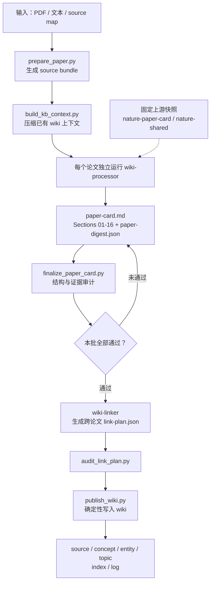

# wiki-paper-card

`wiki-paper-card` 是在 Obsidian 中运行的论文阅读与知识沉淀工作流，用于把持续积累的论文转化为可以追溯、对比和持续扩展的个人研究 Wiki。

它先为每篇论文生成一张带页码、图、表和公式定位的 Paper Card，再在批量处理时把得到多篇论文支持的证据连接成概念、实体和 topic 页面。

[English](README.en.md)


> 状态：核心流程已经可以运行，项目仍会继续迭代流程契约、知识规则和输出格式。

## 运行环境与入口

本项目以 [Claude Code](https://code.claude.com/docs/en/overview) 为运行宿主，在 [Obsidian](https://obsidian.md/download) 中通过 [Claudian](https://community.obsidian.md/plugins/realclaudian) 插件使用。Claudian 的官方仓库见 [GitHub](https://github.com/YishenTu/claudian)。

推荐在 Obsidian 中打开一个由 `template/` 初始化的独立 Vault，不要直接打开本仓库根目录。仓库根目录还包含 `vendor/`、`scripts/`、`tests/` 等实现文件。

## 项目定位

`wiki-paper-card` 面向需要长期维护个人研究 Wiki 的研究人员。它将工作分成两个阶段：先独立精读每篇论文，再跨论文筛选和连接值得沉淀的知识。

1. **读论文**：每篇论文独立生成一份完整的 Sections 01-16 Paper Card，关键结论都带页码、图、表和公式定位，便于回到原文核对。
2. **沉淀知识**：批量处理完成后，项目会跨论文核对候选概念与实体。只有同一对象至少有两篇独立来源提供证据支持，或者直接用于连接已有 Wiki 页面、回答已有开放问题时，才会创建概念或实体枢纽页；仅在单篇论文中出现、尚未被其他来源印证的候选仍留在 Paper Card。

为了在保留完整论证的同时，让跨论文比较和检索更容易，项目把论文细节与跨论文知识放在不同层次：Paper Card 保存完整细节；概念和实体页只保存稳定定义、来源证据、关系和矛盾，形成薄枢纽；topic 页负责跨论文比较和综合。这样，Wiki 在持续增长时仍能保持可检索、可对比、可追溯。

## 核心能力

- 生成带页码、图、表和公式定位的 Sections 01-16 Paper Card。
- 批量独立处理论文，避免单篇论文之间相互污染上下文。
- 通过 L0、L1、L2 三级知识门槛控制建页：论文内局部概念和待验证候选先留在 Paper Card，只有跨论文证据充分的节点才提升为概念或实体枢纽页。
- 在 topic 页中跨论文对比方法、证据、模型、数据集和结果，区分共识 / 单篇主张 / 分歧，矛盾保留双方并给出裁决证据，研究空白带来源锚点、可检验方向与承接性。
- 增量沉淀：新论文可把既有 L1 候选升级为 L2 枢纽、并入既有 topic 对照表、回答既有开放问题；待升级候选沉淀在 `wiki/meta/candidates.md`。
- 只写能改变读者判断的内容，没有真实价值就留空（宁缺毋滥），避免注水。
- 使用确定性脚本执行 prepare、finalize、audit、publish，重复更新不会制造重复内容，并提供结构化验收。
- 自动维护 `wiki/index.md`、`wiki/log.md` 和来源页关联；处理过程不把完整论文文本送回主会话，以控制上下文开销。

| 等级 | 含义 | 处理方式 |
|---|---|---|
| L0 | 只对当前论文有意义的局部名称、组件或中间概念 | 保留在 Paper Card，不单独建页 |
| L1 | 可以独立定义，但尚未获得第二篇独立来源支持 | 保留在 Paper Card，作为候选 |
| L2 | 至少两篇独立来源支持，或直接用于连接已有 Wiki 页面、回答已有开放问题 | 创建或更新 concept/entity 枢纽页 |

## 与上游 `nature-skills` 的关系

本项目的分析内核和共享规则来自 [nature-skills](https://github.com/Yuan1z0825/nature-skills) 项目。上游目录以固定快照形式保存在 `vendor/nature-paper-card` 和 `vendor/nature-shared` 下。

| 职责 | 来源 |
|---|---|
| Sections 01-16 卡片结构、来源包、证据定位、论文类型镜头、上游审计 | `nature-skills` |
| Obsidian 路径映射、KB context、批量编排、digest、link plan、知识结晶门槛、Wiki 发布与幂等更新 | 本项目 |

本项目在上游论文分析内核之上，增加面向 Obsidian LLM Wiki 的编排和知识结晶层。固定版本、上游 commit、同步策略和第三方声明见 [UPSTREAM.md](UPSTREAM.md) 与 [THIRD_PARTY_NOTICES.md](THIRD_PARTY_NOTICES.md)。

## 设计参考

本项目参考 Karpathy 的 [LLM Wiki](https://gist.github.com/karpathy/442a6bf555914893e9891c11519de94f) 思路，采用 Wiki 分层、Agent 持续维护以及 `index.md`、`log.md` 来组织长期维护的知识库。

## 快速开始

前置条件：

- [Claude Code](https://code.claude.com/docs/en/overview)
- [Obsidian](https://obsidian.md/download)，并安装 [Claudian](https://community.obsidian.md/plugins/realclaudian) 插件
- Python 3
- 处理 PDF 时安装 PyMuPDF

新建或选择一个独立 Vault，将 `template/` 中的内容复制进去，再将本仓库的 skill 和 Agent 链接到该 Vault：

```bash
git clone <repository-url> wiki-paper-card
cd wiki-paper-card

VAULT=/path/to/vault
mkdir -p "$VAULT"
cp -R -n template/* "$VAULT/"

mkdir -p "$VAULT/.claude/skills" "$VAULT/.claude/agents"
ln -s "$PWD/skills/wiki-paper-card" "$VAULT/.claude/skills/wiki-paper-card"
ln -s "$PWD/skills/wiki-shared" "$VAULT/.claude/skills/wiki-shared"
cp adapters/claude-code/agents/*.md "$VAULT/.claude/agents/"
cp template/CLAUDE.md "$VAULT/CLAUDE.md"

export WIKI_PAPER_CARD_ROOT="$PWD"
```

在 Obsidian 中打开 `$VAULT`，不要打开本仓库根目录。上面的 `-n` 会保留目标 Vault 中已有的文件；如果已有 `CLAUDE.md`，请合并相关段落，不要直接覆盖。

`template/` 只提供 Vault 的目录结构。完成上述链接并设置 `WIKI_PAPER_CARD_ROOT` 后，Claudian 才能从 Vault 中发现 `wiki-paper-card`、`wiki-shared` 和子 Agent，并通过该环境变量找到仓库中的脚本与上游快照；只复制模板但不执行安装，skill 不会自动出现。

把论文放到 Vault 的 `raw/papers/` 下，然后在 Claudian 会话中调用：

```text
Use wiki-paper-card to process raw/papers/example.pdf.
```

完整安装说明、环境配置和异常排查见 [docs/installation.md](docs/installation.md)。

## 使用方式

在 Claudian 会话中直接发送 `Use wiki-paper-card ...`。如果插件提供了 skill 选择菜单，也可以先选中 `wiki-paper-card`，再给出处理目标。

### 1. 放置输入

- 论文 PDF 和 `nature-reader` source-map JSON 都放在 Obsidian Vault 的 `raw/papers/` 下。
- `raw/` 只读，处理期间不要移动、覆盖或删除原文件。
- `raw/` 下的主题分类目录需要用户自行规划，系统不会自动分类；建议按研究主题创建子目录，例如 `raw/papers/knowledge-conflict/`。

```text
vault/
├── raw/
│   └── papers/
│       ├── example.pdf
│       └── example.source-map.json
├── wiki/
│   ├── sources/
│   ├── concepts/
│   ├── entities/
│   ├── topics/
│   ├── index.md
│   └── log.md
└── work/
```

例如，`raw/papers/example.pdf` 会生成 `wiki/sources/papers/example.md` 来源页。

### 2. 单篇处理

```text
Use wiki-paper-card to process raw/papers/example.pdf.
```

处理 `nature-reader` source map：

```text
Use wiki-paper-card to process raw/papers/example.source-map.json.
```

单篇处理至少会生成 `wiki/sources/` 下的 Paper Card 来源页。单篇论文不会凭空创建新的 concept、entity 或 topic。

### 3. 批量处理

处理指定目录下的全部 PDF：

```text
Use wiki-paper-card to batch-process raw/papers/knowledge-conflict/.
```

处理 `raw/papers/` 下的全部 PDF：

```text
Use wiki-paper-card to batch-process raw/papers/.
```

批量处理会先生成所有来源页，全部审计通过后再做跨论文链接。建议每批不超过 15 篇，系统最多同时运行 3 个 processor。

### 4. topic 与跨论文页面

concept 或 entity 只有在至少两篇独立来源支持，或者直接连接已有页面、回答已有开放问题时才会创建。topic 只有在至少两篇论文共享同一问题、机制或证据空间，或者新论文回答或挑战已有 topic 的开放问题时才会创建或更新。

批量处理时可以明确提出综合目标：

```text
Use wiki-paper-card to batch-process raw/papers/knowledge-conflict/ and create or update topic pages where at least two papers share the same problem, mechanism, or evidence space.
```

如果条件不满足，框架不会因为提示词要求而强行建页。

### 5. 更新与重新处理

同一 PDF 未变化时，重复处理会跳过。需要重新生成时使用：

```text
Use wiki-paper-card to reprocess raw/papers/example.pdf.
```

处理结果会更新 `wiki/index.md`、`wiki/log.md` 和已有页面，不会自动删除已有知识页。批次中间报告写入 `work/`，最终知识页面写入 `wiki/`。

## Agent 快速安装

用户可以在自己的 Agent 工具中使用一句话启动配置，不需要逐行执行安装命令：

```text
请阅读 /path/to/wiki-paper-card/docs/agent-quick-setup.md，并帮我配置 wiki-paper-card。
项目仓库：/path/to/wiki-paper-card
Obsidian Vault：/path/to/vault
```

Agent 会补齐 Vault 目录、链接 skill、合并 `CLAUDE.md`、设置环境变量并运行 smoke test。详细执行规则和安全边界见 [docs/agent-quick-setup.md](docs/agent-quick-setup.md)。

## 工作流程



## 输出结构

```text
vault/
├── raw/
│   └── papers/
│       └── example.pdf
└── wiki/
    ├── sources/
    │   └── papers/
    │       └── example.md
    ├── concepts/
    ├── entities/
    ├── topics/
    ├── meta/
    ├── index.md
    └── log.md
```

Paper Card 保留论文的完整细节；概念和实体页保持薄枢纽结构；topic 页面负责跨论文综合。审计报告和中间文件位于对应批次的工作目录，不进入最终 Wiki。

## 支持范围

| 项目 | 当前支持 |
|---|---|
| 运行宿主 | Claude Code |
| Obsidian 入口 | Claudian |
| 主要输入 | PDF、`nature-reader` source map |
| Wiki 写入 | 本地 Vault |
| 输出语言 | 跟随用户语言 |

当前版本尚未提供其他 LLM 运行宿主的正式适配。

## 项目结构

```text
skills/wiki-paper-card/    工作流入口、契约和子 Agent 说明
skills/wiki-shared/        Wiki schema、模板和知识结晶规则
adapters/claude-code/      Claude Code subagent wrapper
vendor/nature-paper-card/  固定的上游分析内核
vendor/nature-shared/      固定的上游共享规则
template/                  最小 Obsidian Vault 示例
scripts/                   本地确定性检查、打包和发布脚本
docs/                      安装和架构文档
tests/                     项目脚本测试
```

## 文档

- [安装与运行](docs/installation.md)
- [架构说明](docs/architecture.md)
- [工作流契约](skills/wiki-paper-card/references/workflow-contract.md)
- [Wiki 集成规则](skills/wiki-paper-card/references/wiki-integration.md)
- [知识结晶模型](skills/wiki-shared/references/knowledge-model.md)

## 验证

```bash
PYTHONDONTWRITEBYTECODE=1 python3 -m unittest discover -s tests -v
PYTHONDONTWRITEBYTECODE=1 python3 scripts/smoke_test.py
PYTHONDONTWRITEBYTECODE=1 python3 -m unittest discover -s vendor/nature-paper-card/tests -v
PYTHONDONTWRITEBYTECODE=1 python3 -m unittest discover -s vendor/nature-shared/tests -v
```

## 贡献

欢迎通过 Issue 和 Pull Request 参与。

- 请勿提交个人论文 PDF、私人 Vault 内容或真实 API Key。
- 修改知识准入规则时，请集中在 `skills/wiki-shared/references/knowledge-model.md`。
- 修改 `vendor/` 前，请记录原因并更新 `UPSTREAM.md`。
- 新增流程前，请先在对应 workflow contract 中明确验收条件。

## 许可证

本项目使用 MIT License，详见 [LICENSE](LICENSE)。

`vendor/nature-paper-card` 和 `vendor/nature-shared` 来自 Apache-2.0 许可的 `nature-skills` 项目，相关声明见 [THIRD_PARTY_NOTICES.md](THIRD_PARTY_NOTICES.md)。
